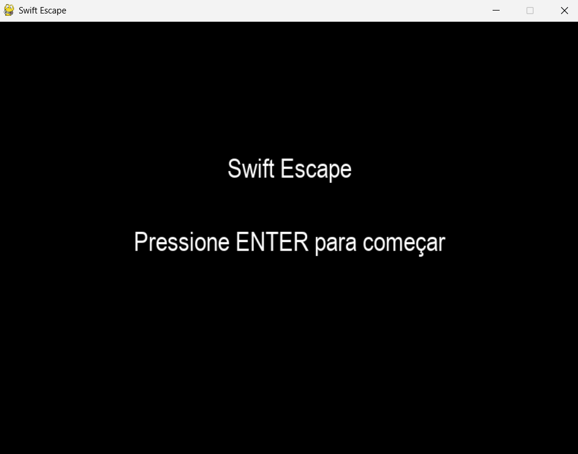
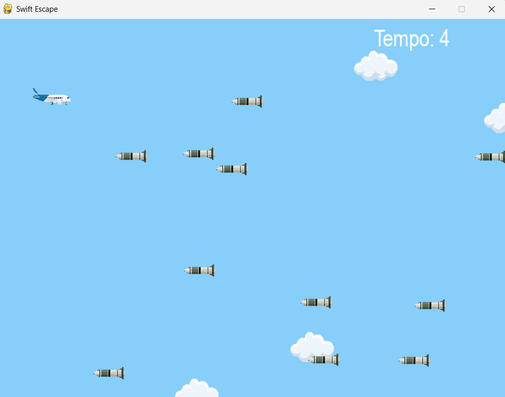

#  Swift Escape

Swift Escape é um jogo 2D desenvolvido em Python com Pygame. O jogador controla um jato que deve desviar de mísseis inimigos enquanto nuvens passam ao fundo. O objetivo é sobreviver o máximo de tempo possível e alcançar a maior pontuação!

##  Funcionalidades

- Controle do jato com as setas do teclado
- Geração aleatória de mísseis e nuvens
- Detecção de colisões
- Contador de tempo em tela
- Menu principal com opção de iniciar e reiniciar o jogo

##  Imagens 

### Menu Inicial


### Gameplay


### Game over


##  Tecnologias Utilizadas

- Python 3
- Pygame

##  Como Executar

1. Clone o repositório:

```
git clone https://github.com/GianiBraga/SwiftEscape.git
```

2. Acesse a pasta:
```
cd SwiftEscape
```

3. Instale o Pygame (se ainda não tiver):

```
pip install pygame
```

4. Execute o jogo:

```
python main.py
```
